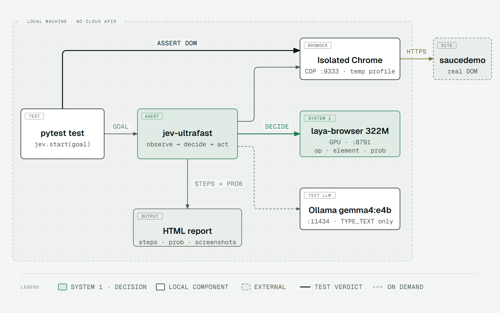
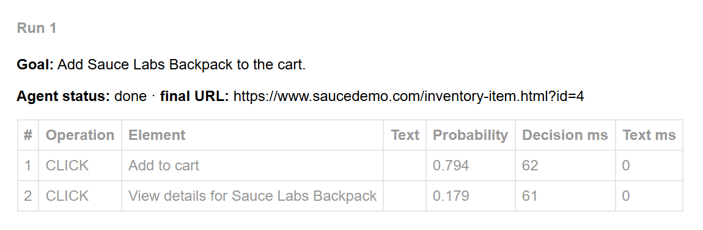
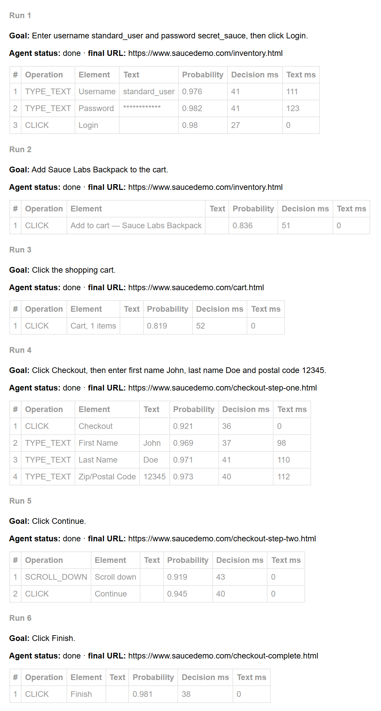

https://github.com/user-attachments/assets/ebff5e4e-d948-4513-b849-a853038ab8e6

# jev-ultrafast AI Framework for UI Tests

Selector-free UI tests for [saucedemo.com](https://www.saucedemo.com/): a test states a goal in natural language,
and a "System 1" decision model (one forward pass, no text generation) picks the operation and the page element.
The verdict comes from a deterministic check of the real DOM, not from the model.

Everything runs locally: no cloud TypeSafe Jev, no external LLM APIs.


> [!WARNING]
> ⚠️ **Tested only on Windows 11 + NVIDIA GPU** (locally and in Docker Desktop + WSL2). macOS is not supported yet — see [Limitations](#limitations).

## Why

### Context

In September 2026 browser-use released [jev-ultrafast](https://github.com/browser-use/jev-ultrafast), a browser agent
that does not generate actions token by token like typical LLM agents. Decisions come from a "System 1" model
(TypeSafe Jev): in a single forward pass it chooses an operation (CLICK, TYPE_TEXT, SELECT, DONE, ...) and an element
from those actually observed on the page. In effect it is a "smart if": it picks from given options instead of
composing an answer. A small LLM is involved only when text has to be typed.

Cloud Jev is waitlisted and paid, so this project uses an open alternative,
[laya-browser](https://huggingface.co/cklxx/laya-browser), fine-tuned for exactly the requests jev-ultrafast sends.

### What was done

1. Studied jev-ultrafast, browser-harness, laya and its browser fine-tune.
2. Replaced cloud Jev with a local decision server (laya-browser on GPU) and the text LLM with a local `gemma4:e4b` in Ollama.
3. Wrapped it all in a pytest framework: isolated Chrome, fixtures, independent DOM checks, an HTML report with the agent's steps.
4. Two ways to run: locally and with `docker compose` (GPU in containers, the browser visible through noVNC).
5. Ran three happy-path saucedemo scenarios. What was found along the way became the rules for phrasing goals
   and the limitations below.

### How it differs

| | Selenium / Playwright | LLM agents (browser-use etc.) | This framework |
|---|---|---|---|
| A step is defined by | selector + action in code | natural-language goal | natural-language goal |
| What the model can do | — | generate any action, including a non-existent one | only choose among observed elements |
| Time per decision | instant | text generation on every step | 25–150 ms (see results) |
| Explainability | stack trace and selector | the model's reasoning as text | probability of every decision in the report |
| Where it runs | locally | usually a cloud API | locally, page data never leaves the machine |

What makes it promising:

- **No locators.** A test describes user intent, not DOM structure, so there are no selectors to maintain.
  Expected (not measured in this experiment): such tests are more robust to markup changes and more sensitive to changes
  in visible text, since the model sees the page the way a user does.
- **Choosing instead of generating.** The model cannot invent a selector or click a non-existent button.
- **Speed and cost.** Tens of milliseconds per decision on a local GPU, no per-token billing.
- **Measurable confidence.** Every decision carries a probability, and the agent stops before a doubtful step
  (see [Containing non-determinism](#containing-non-determinism)).

The downsides, honestly: goals have to be phrased for the model, long scenarios have to be split into steps,
and on ambiguous pages the model sometimes wants an extra action: the confidence threshold stops it, it does not
make the model smarter. For CI regression suites the classic
frameworks are still more reliable. This project is a working template and a test bed for the approach, not a replacement.

## Architecture

<picture>
  <source media="(prefers-color-scheme: dark)" srcset="docs/media/architecture-dark.png">
  
</picture>

| Component | What it is | Why |
|---|---|---|
| [jev-ultrafast](https://github.com/browser-use/jev-ultrafast) | the agent loop: page snapshot → indexed elements → operation + target → execution | the model only chooses among observed elements and never generates selectors or code |
| [cklxx/laya-browser](https://huggingface.co/cklxx/laya-browser) | a fine-tuned [laya](https://github.com/NandhaKishorM/laya) (mmBERT, 322M) speaking Jev's `/v1/systemone` protocol; pinned to revision `645cf366` in `serve.py` (the server code ships with the weights, so the pin fixes both) | a local replacement for Jev; base laya scores ≈ 0% on browser decisions without fine-tuning |
| Ollama + `gemma4:e4b` | writes the field value when TYPE_TEXT is chosen | OpenAI-compatible API, so jev connects through env variables, no code; models under ~4B parameters confuse the fields |
| `framework/chrome.py` | a dedicated Chrome: own CDP port, temporary profile, prefs | the user's browser is never touched; the prefs turn off Chrome's leaked-password dialog, which swallows clicks after login with `secret_sauce` |
| `framework/jev_local.py` | five targeted patches of the pinned jev-ultrafast commit | see below |

### jev-ultrafast patches (`framework/jev_local.py`)

Upstream is pinned to commit `1231850a`. Each patch first checks that the code it changes looks as expected.
If the code changed after a re-pin, the run fails with a clear error instead of silently testing something else.

1. Decision requests go to `LAYA_URL` instead of `api.typesafe.ai`, which is hard-coded upstream (open PR #175).
2. `type=password` fields become visible to the agent: upstream hides them twice, which makes login impossible (PR #123).
3. `TEXT_MODEL_REASONING=none` is also sent as `{"effort": "none"}`. Otherwise Ollama ignores the reasoning switch
   and gemma "thinks" for up to 9 seconds per field (PR #39).
4. Identical labels get the name of their own item: saucedemo's six "Add to cart" buttons do not say which product
   they belong to, so the model picked by position ("Add Bolt T-Shirt" added the Backpack). Now the model sees
   "Add to cart — Sauce Labs Bolt T-Shirt" and picks it at ~0.83. Our own patch, no upstream PR.
5. The text model invents a value the goal does not give: upstream forbids it and answers null. Placeholders are
   banned, otherwise gemma types "John Doe" almost every time. Its requests carry
   a seed, new every session, so the values change between runs and `TEXT_MODEL_SEED` replays them. Our own patch, no upstream PR.

## Containing non-determinism

Randomness is kept away from what decides the verdict: the decision model does not sample, the generative LLM has one
narrow job, and the verdict is plain code.

| Layer | Technique | Where |
|---|---|---|
| Decision | One forward pass over the observed elements, no sampling: the same page and goal give the same choice | jev-ultrafast |
| | A malformed answer (unknown element, probabilities not summing to 1, a choice that is not the most likely) executes nothing | `validate_choice`, jev-ultrafast `model.py` |
| | The text model only fills TYPE_TEXT fields: JSON with a single `text` key; a value from the goal is used as is, a missing one is invented (patch 5); reasoning off (patch 3). The session's seed is in the report, `TEXT_MODEL_SEED=<seed>` replays its values | jev-ultrafast `model.py`, `jev_local.py` |
| Before an action | Confidence threshold: a step with P(operation) × P(target) below 0.5 is not executed, status `blocked`, the reason in `result.error`. A product, because a sure target with an unsure operation is still a doubtful step (0.45 × 0.99) | `_tick`, `framework/runner.py` |
| | An action runs only on the page it was chosen for: a changed page fingerprint raises `StalePage` and the agent decides again. A decision is consumed once, so a retry cannot double-click | jev-ultrafast `agent.py` |
| | The first decision waits for the page to have controls: on an empty page the model answers DONE | `_wait_for_controls`, `runner.py` |
| | Bounds: `max_actions` per goal (status `budget`); three actions in a row that change nothing stop the run (`blocked`) | `runner.py`, jev-ultrafast `agent.py` |
| Input | Duplicate labels get their item's name (patch 4); short goals, preconditions without the agent ([rules](#writing-a-test)); isolated Chrome, clean origin before every test | `jev_local.py`, `chrome.py`, `conftest.py` |
| Verdict | An `assert` on the real DOM or `localStorage`, never the agent's status; exact state, invented values checked in the fields ([rules](#writing-a-test)). `test_low_confidence_step_is_not_executed` checks the threshold itself | `tests/` |
| Pins | jev-ultrafast commit, laya revision, Ollama 0.35.0 in Docker; the patches and the `Agent.state` keys fail loudly when a re-pin changes the code under them | `pyproject.toml`, `serve.py`, `jev_local.py`, `runner.py` |
| Measurement | `--count N` reports pass^N. Repeats measure the environment (timing, network, browser), not the decisions or the typed values (one seed per session); robustness to phrasing needs varied goals, which the suite does not cover yet. Every step's probability is in the [report](#report) | `conftest.py` |

## Running locally

Requires [uv](https://docs.astral.sh/uv/), Chrome, Ollama (tested with 0.35.0; desktop app or CLI, same server)
and an NVIDIA GPU (CPU works too, but slower).

```bash
# 1. decision server: keep it running in a separate terminal
#    (own environment with torch; the first start downloads ~0.7 GB of weights)
uv run --project services/decision python services/decision/serve.py

# 2. text model
ollama pull gemma4:e4b

# 3. tests
cp .env.example .env
uv run pytest -m "not live"            # offline adapter checks, no models needed
uv run --env-file .env pytest          # everything, in a visible Chrome window
uv run --env-file .env pytest --headless --record-steps
uv run --env-file .env pytest -m live --headless --count 3   # every test 3 times, the summary reports pass^3
```

If the decision server is not running, the live tests stop before opening the browser with
`Decision server not reachable at ... Start it in another terminal: ...`.

### Configuration

| Variable | Default | Purpose |
|---|---|---|
| `LAYA_URL` | `http://127.0.0.1:8791` | decision server |
| `DECISION_HOST`, `DECISION_PORT` | `127.0.0.1` (`0.0.0.0` in Docker), `8791` | where `serve.py` listens; change `LAYA_URL` to match |
| `TEXT_MODEL_BASE_URL`, `TEXT_MODEL`, `TEXT_MODEL_API_KEY` | Ollama, `gemma4:e4b`, `ollama` | any OpenAI-compatible endpoint for TYPE_TEXT |
| `TEXT_MODEL_REASONING` | `none` | turns off the text model's "thinking" |
| `TEXT_MODEL_SEED` | random per session | replays the values a session typed (the seed is in the report) |
| `CHROME_PATH` | standard Chrome/Chromium locations | a custom browser binary |
| `CHROME_EXTRA_ARGS` | empty (`--no-sandbox` in Docker) | extra Chrome flags |
| `CHROME_CDP_PORT` | `9333` | CDP port of the isolated Chrome |

pytest flags: `--headless` (no window), `--record-steps` (a frame after every action; included in the report for failed tests),
`--count N` (pytest-repeat: every test N times; the summary reports pass^N, the share of tests that passed all N trials,
as in [τ-bench](https://arxiv.org/abs/2406.12045); what repeats do and do not catch: [Containing non-determinism](#containing-non-determinism)).

## Running in Docker

```bash
docker compose run --rm --service-ports tests              # live tests, browser visible at http://localhost:7900/vnc.html
docker compose run --rm tests -m live --headless           # no display
docker compose down                                        # stop decision and ollama
```

`tests` starts `decision` and `ollama` on its own. The `ollama-init` service downloads the model into a volume once.
The report appears on the host in `./reports` (bind mount): it stays after `--rm` and `docker compose down -v`. Only noVNC is published, and only on `127.0.0.1`.
Requires an NVIDIA GPU: `compose.yaml` reserves one for `decision` and `ollama`.
The GPU is passed through Docker Desktop + WSL2: on Windows only the NVIDIA driver is needed.
Everything else is inside the containers (Ollama pinned to 0.35.0), so a host Ollama and its settings do not matter.
The first run downloads ~7 GB of weights; later runs reuse the volumes. The `decision` image is ~11 GB, ~7 GB of it torch with CUDA.

### Where the models live and how to remove everything

<details>
<summary>Paths, sizes and cleanup commands</summary>

| What | Where | Size |
|---|---|---|
| laya-browser checkpoint (local) | Hugging Face cache: `~/.cache/huggingface/hub` | ~0.7 GB |
| `gemma4:e4b` (local) | Ollama model directory (`OLLAMA_MODELS` or the path in Ollama settings) | ~6.6 GB |
| Docker images | `ai-at-framework-decision`, `ai-at-framework-tests` | ~11 GB and ~1.7 GB |
| models in Docker | volumes `ai-at-framework_hf-cache`, `ai-at-framework_ollama-models` | ~7 GB |

```bash
docker compose down -v                                                   # containers + model volumes
docker image rm ai-at-framework-decision ai-at-framework-tests
ollama rm gemma4:e4b
```

</details>

## Writing a test

The `jev` fixture is `JevSession` from `tests/conftest.py`. `start()` opens a page and runs a goal,
`then()` runs the next goal in the same tab. Both return the run result and the live page,
and the check is a plain `assert` against the real DOM:

```python
def test_login(jev):
    result, page = jev.start("/", "Enter username standard_user and password secret_sauce, then click Login.",
                             max_actions=6)
    assert page.evaluate("location.pathname") == "/inventory.html", result.outcome  # status + agent error
```

Chrome starts once per session. Before every test the `site` fixture clears saucedemo's cookies and `localStorage`,
so tests do not depend on each other or on their order.

Rules for phrasing goals (found experimentally):

- one short goal per action or per form; long scenarios as a chain of `then()` calls with a check after each step;
- explicit verbs and element names as they appear on the page: "Enter ..., then click Login.", "Click Checkout.";
- submit a form as a separate goal after typing (`then("Click Continue.")`);
- set `max_actions` slightly above the minimum needed: extra steps show up in the report, and a loop stops
  with status `budget`;
- the agent's status (`done`) is not a verdict. Check the result on the page or in `localStorage`;
- check *which* item changed, not how many: `cart-contents == "[4]"`, not a cart badge of "1". A wrong but similar
  action keeps a count right;
- name the fields, not the values ("enter first name, last name and postal code"): the text model invents them,
  and the test checks that every field holds what the agent typed (`result.steps`). Values the test depends on,
  like the login, go into the goal and are typed as given;
- prepare preconditions that the test does not verify without the agent (e.g. the `logged_in` fixture sets a cookie).

## Report

`reports/report.html` is a single self-contained file (pytest-html). The results table has columns for the agent status,
number of actions, agent time and average decision latency. Each test card shows, for every agent run:
the goal, a step table (operation, element, typed text, probability, decision and text ms) and the final screenshot.
Passwords are masked. With `--record-steps`, failed tests also get a frame after every action.
Raw data for every run is in `reports/artifacts/<test>/run-N/run.json`.
A step stopped by the confidence threshold is shown as the agent error, with its probability.



<details>
<summary>Full card of <code>test_full_checkout</code>: six goals in one tab</summary>



</details>

## Results (RTX 4090 Laptop)

All tests passed 3 out of 3 locally. In Docker they did before the text model started inventing form values
(patch 5) and have not been rerun since. Decision model latency, per decision:

| Local (Windows) | Docker (Linux) |
|---|---|
| 40–150 ms | 25–40 ms |

In the Linux container torch runs some operations as Triton kernels, which makes decisions 2–4× faster than on Windows.

Locally the text model takes 100–190 ms per field, and the agent spends about 5 s on the whole live suite,
over half of it in the browser (actions, waiting for the page to settle) rather than in the models.

## Limitations

- Tested only on Windows 11 with an NVIDIA GPU, locally and in Docker Desktop + WSL2. macOS is not supported yet:
  Chrome paths, the CUDA-only torch index and the GPU reservation in `compose.yaml` are Windows/NVIDIA-specific.
- No CI: the live tests need an NVIDIA GPU, which standard GitHub-hosted runners do not have
  (GPU runners require a paid Team/Enterprise plan). The suite runs locally or in local Docker.
- The confidence threshold (0.5, on P(operation) × P(target)) is tuned on saucedemo, where every intended step
  scores 0.77 or higher;
  another site may need a different value.
- The agent only sees the browser window and rarely scrolls. For an item below it, the model may confidently open the
  item's page or answer DONE instead of scrolling to its button. The threshold does not catch a confident choice;
  the page assertion does.
- jev-ultrafast is an MVP: shadow DOM, iframes, file uploads and pop-up windows are not supported.
- Goals are written for the model, not for a human. That is the price of a 322M model deciding in tens of milliseconds.

